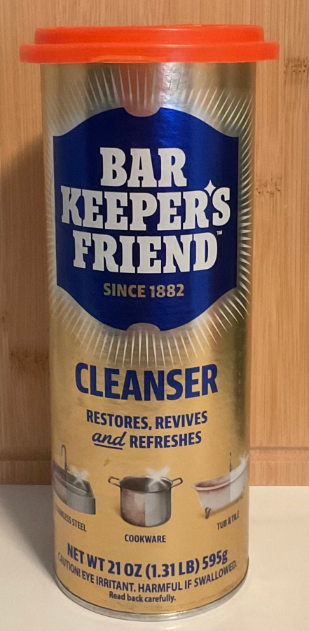

# Bar Keeper's Friend Hack
Bar Keeper's Friend is a fantastic product for cleaning with a weak package design. Once you peel up that sticker and dispense the product, some of it gets onto the top and the sticker never does stick back down properly again. In that condition, the contents can spill if the can is knocked over and moisture can get in from the air. You could wrap plastic-wrap around it or put a sandwich-bag on it and hold it on with a rubber band, but there's a better way:

It turns out that those cheap pet-food can-covers you can get at the grocery store fit **perfectly** on the top of the can! They keep the product in, moisture out, and are easy to put on and take off:

Total win!

Come to think of it, those multi-pack pet-food lids often come in cheap packages of three at the grocery store, which is a perfect bonus win. Although I don't currently have an Ajax or Comet can on hand to photograph, all three brands use identical industry-standard 21-ounce canister diameters. A single three-pack of lids will perfectly cap your entire collection! 

Feel free to try it out on yours and share the results with the rest of us in the [Discussions](https://github.com/Elliria/til/discussions) section.
-----
**Tags:** tag-cleaning tag-household tag-life_hack
